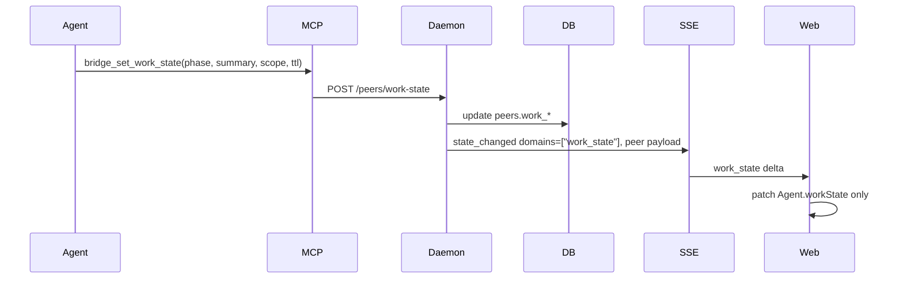
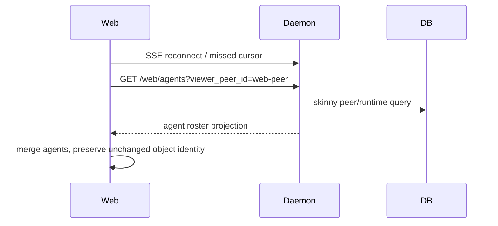

# Agent Work State v1

Status: revised after Plannotator feedback; Beads filed under `sync-08gl`.
Branch: `codex/agent-work-state-plan`. Implementation is deferred to the Beads
tree below.

## Purpose

Synchronize already knows whether a peer is online, initializing, working, idle,
or offline. That is a good presence signal, but it is too coarse for coordinating
agent work. The new feature should let every connected agent publish what kind
of work it is actively doing right now: research, analysis, planning,
implementation, testing, review, coordination, blocked, or a short custom
summary.

This should be visible in the daemon state, MCP tools, skills, and web UI without
turning every work-state update into a full `/web/state` refresh. The UI should
react quickly to phase changes while preserving the existing reliable bootstrap
and polling fallback behavior.

## Terminology Decision

Use **work state**, not **role**, for the dynamic lifecycle field.

`role` is already used in the web `Agent` model for a relatively static label.
In daemon-backed mode it currently maps to `peer.tool` (`claude`, `codex`, `pi`,
`web`, etc.); in mock data it is a capability label such as "Backend /
refactors". Overloading that field with "implementation" or "research" would
make the UI harder to reason about and would hide the distinction between "what
is this peer?" and "what is this peer doing right now?".

The proposed vocabulary:

- **Presence**: existing coarse liveness/availability, derived from lease plus
  `peers.activity_state`.
- **Work state**: new optional dynamic task state, explicitly set by the agent
  and automatically expired by TTL.
- **Phase**: a controlled enum inside work state, such as `research` or
  `implementation`.
- **Summary**: short free-text "what I am focused on" string.
- **Scope**: optional structured location such as a group, DM, issue, file,
  branch, or repo path.

## Current System Map

### Daemon State

Peer presence lives on `peers`:

- `activity_state`: `initializing | working | idle | null`
- `last_activity_at`
- `lease_expires_at`
- lifecycle/archive fields

The presence derivation is intentionally read-time:

- archived peers render offline
- expired leases render offline
- valid activity state renders as that state
- uninstrumented but leased peers render online

Important invariant: heartbeat and activity updates do not resurrect archived
peers. Re-registration is the revival path.

This feature must not change the existing `activity_state` semantics or the
existing presence derivation. Work state is an additive layer above activity
state, not a rewrite of the current presence logic.

### Existing Activity API

`POST /peers/activity` accepts either:

- `{ peer_id, state }`
- `{ host_tool, host_session_id, state }`

The host-session form is load-bearing for stateless Claude hooks. The endpoint
refreshes the lease and emits a web `peers` invalidation.

### MCP

MCP registration is intentionally thin:

- `bridge_register` establishes peer identity and heartbeat/subscription.
- `bridge_whoami` returns peer, binding, runtime context, notify mode, and
  heartbeat/subscription status.
- `bridge_list_peers` exposes the roster.

The lifecycle helper currently has `markWorking()`, used for Claude inbound
channel delivery. This updates the existing coarse activity state only.

### Host Hooks and Adapters

Claude hook support already maps host lifecycle to coarse activity:

- `UserPromptSubmit` -> working
- `PreToolUse` -> working
- `Stop` -> idle
- `SessionStart` -> bootstrap

Pi and Letta integrations also have activity seams, but these are coarse process
or session signals. They cannot reliably infer semantic phases such as research
versus implementation.

### Web State and SSE

The daemon exposes:

- `GET /web/state`: broad bootstrap/projection endpoint
- `GET /web/events`: SSE stream of invalidation envelopes
- `GET /activity/:peerId`: dedicated cross-room activity feed

The SSE payload currently contains only coarse metadata:

```ts
{
  cursor,
  type: "state_changed",
  domains,
  event_id?,
  group_id?,
  peer_id?
}
```

`DaemonDataSource.scheduleInvalidation()` treats nearly every non-reaction
change as broad:

1. refetch `/web/state`
2. refetch activity
3. refresh affected room/DM snapshots when loaded

That is fine for message/group changes, but inefficient for frequent peer
presence or work-state updates.

### Frontend State

The web app has a strong seam: components read `DataSource` snapshots through
hooks, and both `MockDataSource` and `DaemonDataSource` implement the same
contract.

Current agent shape:

```ts
interface Agent {
  id: string;
  name: string;
  handle: string;
  color: string;
  role: string;
  status: "online" | "busy" | "idle" | "offline";
  statusNote?: string;
  runtimeDetails?: AgentRuntimeDetails;
  ...
}
```

Many components use `useAgents()`: roster, room header, sidebar, composer,
activity view, timeline rail, board view, thread pane, chat view, and app shell.
That means noisy agent updates can fan out through a large part of the UI unless
the data layer preserves object identity for unchanged agents or splits hot
state into a narrower snapshot.

## Proposed Data Model

### API Type

Add an explicit work-state object to the shared API type:

```ts
export type WorkPhase =
  | "research"
  | "analysis"
  | "planning"
  | "implementation"
  | "testing"
  | "review"
  | "coordination"
  | "blocked"
  | "other";

export interface WorkScope {
  kind: "group" | "dm" | "issue" | "file" | "repo" | "branch" | "url" | "custom";
  value: string;
  label?: string;
}

export interface PeerWorkState {
  phase: WorkPhase;
  summary: string;
  scope?: WorkScope;
  /**
   * Free-form task/objective label for v1. Examples:
   * "sync-123 agent work state plan", "debugging SSE churn",
   * "untracked architecture research".
   */
  task?: string;
  trigger_event_id?: number;
  started_at: string;
  updated_at: string;
  expires_at: string;
  source: "mcp" | "hook" | "api";
}
```

Then add:

```ts
interface Peer {
  ...
  work_state?: PeerWorkState | null;
}
```

### Storage Shape

For v1, store current work state directly on `peers`.

Recommended columns:

- `work_phase TEXT`
- `work_summary TEXT`
- `work_scope_json TEXT`
- `work_task TEXT`
- `work_trigger_event_id INTEGER REFERENCES events(event_id)`
- `work_started_at TEXT`
- `work_updated_at TEXT`
- `work_expires_at TEXT`
- `work_source TEXT`

Reasons to use peer columns in v1:

- work state has the same grain as presence: one current state per peer
- roster and membership queries already join peer rows
- it keeps `/peers`, `/web/state`, and activity enrichment simple
- history can be appended from the same write path without making live roster
  reads expensive

Add an index for expiry lookup:

```sql
CREATE INDEX IF NOT EXISTS idx_peers_work_expires_at
ON peers(work_expires_at)
WHERE work_expires_at IS NOT NULL;
```

### History Shape

Store an append-only history row whenever the current work state changes
materially.

Recommended table:

```sql
CREATE TABLE IF NOT EXISTS peer_work_state_history (
  history_id INTEGER PRIMARY KEY AUTOINCREMENT,
  peer_id TEXT NOT NULL REFERENCES peers(peer_id),
  phase TEXT,
  summary TEXT,
  scope_json TEXT,
  task TEXT,
  trigger_event_id INTEGER REFERENCES events(event_id),
  correlation_method TEXT NOT NULL DEFAULT 'explicit',
  source TEXT NOT NULL,
  started_at TEXT,
  updated_at TEXT NOT NULL,
  expires_at TEXT,
  cleared_at TEXT,
  created_at TEXT NOT NULL DEFAULT (strftime('%Y-%m-%dT%H:%M:%fZ','now'))
);
```

Recommended indexes:

```sql
CREATE INDEX IF NOT EXISTS idx_peer_work_state_history_peer_time
ON peer_work_state_history(peer_id, updated_at DESC);

CREATE INDEX IF NOT EXISTS idx_peer_work_state_history_event
ON peer_work_state_history(trigger_event_id)
WHERE trigger_event_id IS NOT NULL;
```

Current state stays on `peers` for fast roster reads. History exists for
correlation, audit, and answering questions such as "what tasks or issue labels
did this agent work through in sequence?"

History should not emit a separate UI event unless the current state changed.
The write path can append history and update current state in the same
transaction.

### Scope Versus Task Text

Keep `scope` and `task` separate:

- `scope` describes where the work is happening: group, DM, file, repo, branch,
  URL, or custom context.
- `task` describes the objective or task label in free-form text.

For Beads in v1, use a plain string:

```ts
{
  task: "sync-123 agent work state v1"
}
```

This keeps issue labels visible in history without coupling v1 to a Beads data
model. Abstract work can publish no `task`, or use a plain label such as
`"agent-work-state architecture pass"`.

### Expiry Semantics

Work state must be TTL-bound.

Recommended defaults:

- default TTL: 15 minutes
- minimum TTL: 1 minute
- default maximum TTL: 8 hours
- daemon config may raise the maximum for local workflows that intentionally run
  long-lived agents

Rules:

- Work-state writes compute `expires_at` server-side.
- Agents can set `ttl_minutes` explicitly when they know a phase will run longer
  than the default.
- Heartbeat does **not** renew work-state TTL.
- `POST /peers/activity` does **not** renew work-state TTL.
- Repeating the same work-state update may renew `expires_at`, but should be
  no-op suppressed if the effective state and expiry bucket are unchanged.
- Reads should derive `work_state: null` when `work_expires_at <= now`.
- A clear operation sets all `work_*` columns to null and emits a work-state
  change. It also appends a history row with `cleared_at`.
- Archived peers should not display active work state. On read, archived peers
  derive `work_state: null`; on archive, clearing the columns is acceptable.

TTL is important because the daemon cannot infer "not working on this anymore"
from bus silence. The agent must explicitly publish state, and stale state must
self-clear.

## API Surface

### REST

Add:

```http
POST /peers/work-state
```

Input:

```ts
type SetPeerWorkStateRequest =
  | {
      peer_id: string;
      phase: WorkPhase;
      summary: string;
      scope?: WorkScope;
      task?: string;
      trigger_event_id?: number;
      ttl_minutes?: number;
    }
  | {
      host_tool: string;
      host_session_id: string;
      phase: WorkPhase;
      summary: string;
      scope?: WorkScope;
      task?: string;
      trigger_event_id?: number;
      ttl_minutes?: number;
    }
  | {
      peer_id: string;
      clear: true;
      trigger_event_id?: number;
    }
  | {
      host_tool: string;
      host_session_id: string;
      clear: true;
      trigger_event_id?: number;
    };
```

Output:

```ts
{
  peer: Peer;
  work_state: PeerWorkState | null;
  ttl_minutes: number | null;
  expires_at: string | null;
}
```

Echoing `ttl_minutes` and `expires_at` is intentional. It reminds the caller
what TTL the daemon actually accepted after defaulting, clamping, or clearing.

Validation:

- reject unknown `phase`
- trim and cap `summary`; suggested max 180 characters
- cap `scope.value`; suggested max 500 characters
- trim and cap `task`; suggested max 240 characters
- validate `trigger_event_id` if present; it must reference an existing event
- reject invalid TTL values after normalization
- resolve `host_tool + host_session_id` exactly like `/peers/activity`

When setting a non-clear work state, the endpoint may reuse the existing
activity-update path to mark the peer `working`, because an explicit work-state
update is proof of active work. It must not change what `activity_state` means,
how presence is derived, or any lifecycle/archive behavior.

Add a history read endpoint:

```http
GET /peers/:peerId/work-state-history?limit=100&from=2026-06-27T00:00:00Z&to=2026-06-27T23:59:59Z
```

Optional filters:

- `phase=implementation`
- `task_contains=sync-123`
- `scope_kind=file`
- `scope_value=src/mcp/tools/peers.ts`
- `event_id=12345`
- `correlation=explicit|timestamp_inferred|none`

Pagination should be time-oriented. `history_id` can exist as an internal stable
row id, but it should not be the primary mental model for filtering. If cursor
pagination is needed, use an opaque cursor derived from `(updated_at,
history_id)` rather than asking users or agents to track raw ids.

The history endpoint should include explicit `trigger_event_id` when present and
may include an inferred nearby event in a separate field, clearly labeled as
inferred:

```ts
interface PeerWorkStateHistoryRow {
  history_id: number;
  peer_id: string;
  phase: WorkPhase | null;
  summary: string | null;
  scope?: WorkScope;
  task?: string;
  trigger_event_id?: number;
  inferred_event_id?: number;
  correlation_method: "explicit" | "none" | "timestamp_inferred";
  source: "mcp" | "hook" | "api";
  started_at?: string;
  updated_at: string;
  expires_at?: string;
  cleared_at?: string;
}
```

### Event Correlation

Work-state changes may be related to a bus event. Support this directly:

- If the caller passes `trigger_event_id`, store it on both the current peer row
  and the history row with `correlation_method: "explicit"`.
- If the caller does not pass an event id, keep `trigger_event_id: null` and
  `correlation_method: "none"` in the history row.
- For analysis queries, provide a helper query that can correlate a work-state
  history row to nearby events by timestamp, peer, group, or DM context. That
  inference should be labeled `timestamp_inferred`; do not mutate old history
  rows just because an inferred match exists.

This avoids making timestamp guessing part of the write path while still letting
future analysis ask "which event probably caused the agent to switch into
implementation?"

### Existing Peer Reads

Update:

- `GET /peers`
- group-scoped `GET /peers?group=...`
- `/web/state`
- activity peer enrichment
- `bridge_whoami`
- `bridge_list_peers`

All read paths should expose the same derived `work_state` behavior: null when
expired, archived, deleted, or not set.

### Unified Agent Details Endpoint

Add a unified web agent projection endpoint:

```http
GET /web/agents?viewer_peer_id=:webPeerId
GET /web/agents/:peerId?viewer_peer_id=:webPeerId
```

Response:

```ts
{
  agents: WebAgentProjection[];
  cursor: number;
}
```

`WebAgentProjection` should become the single UI-facing shape for agent details:
peer presence/activity/lifecycle/archive fields, work state, launch lifecycle
summary, AOE/runtime details, and the fields currently needed by profile view.
It should not include groups, room summaries, events, media, skill catalog, or
full room windows.

Use it in three places:

- roster fallback/resync after missed work-state/presence SSE frames
- profile/details view
- `/web/state` bootstrap mapping, by sharing the same projection helper

This endpoint should replace parallel profile-detail mechanisms instead of
becoming a second source of agent truth. Keep `/web/state` as bootstrap and
deep-link hydration, but make its agent objects come from the same projection.

## MCP Surface

Add:

```ts
bridge_set_work_state({
  phase?: WorkPhase,
  summary?: string,
  scope?: WorkScope,
  task?: string,
  trigger_event_id?: number,
  ttl_minutes?: number,
  clear?: boolean
})
```

The same tool clears state when called with `{ clear: true }`. Avoid adding a
separate clear tool unless a concrete host integration later proves that the
single-tool shape is awkward. Returning the updated `peer` keeps the call
self-verifying.

Tool descriptions should instruct agents to call `bridge_set_work_state` when
they enter a materially different phase:

- researching external or local sources
- analyzing code or behavior
- planning/designing
- implementing filesystem changes
- testing or debugging failures
- reviewing
- blocked or waiting on user/external state

`bridge_whoami` should include the current work state and whether it is nearing
expiry. That gives agents a low-cost way to inspect whether they are stale.

### Task Text and Future Beads Tracking

V1 should not implement structured Beads tracking.

Recommended agent behavior:

- If the work has a Beads issue, put the issue id in `task`, for example
  `"sync-123 agent work state v1"`.
- If work is abstract, exploratory, or not tracked in Beads, use a plain task
  label or omit `task`.
- When switching tasks, publish a new work state rather than mutating only the
  summary.

This is enough for the history table to show a useful sequence of work labels
without building a Beads framework into the first iteration. A later plan can
replace or supplement `task` with structured task references if the v1 history
proves useful.

### Agent Prompting and Skills

Update the Synchronize skill/MCP instructions to make work-state publishing part
of normal collaboration:

- On registration or before substantial work: set work state.
- Before file edits: switch to `implementation`.
- Before tests/debugging: switch to `testing`.
- During code-reading-only passes: use `analysis`.
- During plan writing: use `planning`.
- When waiting for feedback: use `blocked` or clear state, depending on whether
  the agent is still actively blocked on the task.
- At final handoff: clear state or set idle via existing activity.

Do not attempt semantic phase inference in host hooks. Hooks can keep setting
coarse `working`/`idle`; semantic phase comes from explicit MCP calls. Any future
semantic inference should wait until the explicit work-state system is stable and
well-tested.

### Deferred Beads Hook Nudge

Keep Beads command nudges out of the first implementation. After the explicit
MCP state path and history table are proven, add an advisory nudge:

- After `bd update <id> --claim`, prompt the agent to publish or renew work state
  with `task` containing the issue id.
- After `bd close <id>`, if the current work state's task text references that
  issue, prompt the agent to clear state or switch to the next task.
- If a hook cannot identify the peer/session, it should emit a local reminder
  rather than writing daemon state directly.
- The hook should not block Beads commands and should not require every work item
  to have a Beads issue.

This is a follow-up phase, not a prerequisite for v1.

### Reminder Hook

The desired "every ten turns or every ten minutes" reminder is best modeled as a
host/client behavior, not daemon inference.

V1 should do the durable substrate:

- TTL expiry
- `bridge_whoami` exposes expiry/staleness
- MCP instructions tell the agent when to update

V2 can add host-specific reminders:

- Codex/Claude plugin hook notices elapsed wall time since last work-state write
- hook injects a lightweight reminder into the agent context
- reminder has a minimum gap, such as 10 minutes
- reminder does not write state on the agent's behalf

This staging avoids pretending the daemon can count model turns across every host
integration today.

## Web/UI Plan

### Data Contract

Extend `web/src/data/types.ts`:

```ts
export interface AgentWorkState {
  phase: WorkPhase;
  summary: string;
  scope?: WorkScope;
  task?: string;
  triggerEventId?: number;
  startedAt: string;
  updatedAt: string;
  expiresAt: string;
  source: "mcp" | "hook" | "api";
}

interface Agent {
  ...
  workState?: AgentWorkState;
}
```

Keep `Agent.role` stable for the existing tool/capability label. New UI reads
`agent.workState`.

### Dynamic Feedback Surfaces

Add visible work-state feedback to existing surfaces:

- **AgentRoster**: show a compact phase chip plus summary line for active work.
  Keep sections grouped by coarse `status` so online/idle/offline behavior stays
  familiar.
- **AgentPreview**: add a "Current Work" section with phase, summary, scope,
  last updated, and expiry.
- **AgentPreview history drill-down**: add a compact "Recent Work" list backed
  by the history endpoint, loaded only when the profile/dialog opens. Show phase,
  summary, task text, and linked event when available.
- **ActivityView header**: replace the simple busy count with phase-aware counts,
  for example "3 working: implementation 1, testing 1, research 1".
- **RoomHeader**: keep the working count, optionally expose phase breakdown in a
  hover/menu or compact tooltip.
- **Sidebar DM rows**: show a small phase affordance only when it fits; avoid
  adding noisy long text to dense rows.
- **ActivityItem actor affordance**: status dot/preview can include current phase
  in the profile popover, not inline on every row.

Do not add a marketing-style explanation panel. This is operational UI; users
need glanceable live status, not instructions.

### Frontend Query Efficiency

Current behavior is too broad for work-state changes. A single work-state update
should not force:

- full `/web/state` rebuild
- activity feed refresh
- room refreshes
- skill catalog/launch profile remapping

Change the invalidation model:

```ts
type WebStateChange =
  | { type: "state_changed"; domains: ["events" | "messages" | "inbox" | ...]; ... }
  | {
      type: "state_changed";
      domains: ["work_state"];
      peer_id: string;
      agent?: WebAgentProjection;
    }
  | {
      type: "state_changed";
      domains: ["peer_presence"];
      peer_id: string;
      agent?: WebAgentProjection;
    };
```

Client handling:

- `work_state` with payload: patch only the matching agent snapshot.
- `peer_presence` with payload: patch only status/presence fields.
- `work_state` without payload: fetch `/web/agents`, not `/web/state`.
- `peer_presence` without payload: fetch `/web/agents`, not `/web/state`.
- `events/messages/inbox`: refresh activity and affected rooms.
- `groups`: refresh summary/room data.
- `agent_sessions/launch`: refresh summary or skinny agent endpoint depending on
  whether room membership can change.
- `reactions`: keep current single-event refresh path.

This keeps `/web/state` as a bootstrap/deep-link endpoint instead of the default
answer for every invalidation.

### Snapshot/Re-render Strategy

V1 can keep `workState` on `Agent`, but `DaemonDataSource` should update agents
with an id-keyed patch helper that preserves object identity for unchanged
agents. The existing `reuseEqualAgents()` uses whole-array JSON comparison; it
can avoid identical updates but does not protect unaffected objects in a changed
array.

Add a helper like:

```ts
function patchAgent(
  prev: Agent[],
  id: string,
  patch: (agent: Agent) => Agent
): Agent[] {
  let changed = false;
  const next = prev.map((agent) => {
    if (agent.id !== id) return agent;
    const updated = patch(agent);
    changed ||= updated !== agent;
    return updated;
  });
  return changed ? next : prev;
}
```

If later we update work state very frequently, split a dedicated
`agentWorkStates()` snapshot out of the `DataSource`. Do not do that in v1 unless
profiling shows the broader agent snapshot is a problem; phase changes should be
occasional, TTL renewals should be no-op suppressed, and the UI already has many
legitimate consumers of `useAgents()`.

### Mock and Storybook

Mock and Storybook must model the real contract:

- add seed work states for research, implementation, testing, blocked, and
  expired/absent cases
- add seed history rows with at least one issue-label sequence and one generic
  no-task sequence
- update `MockDataSource` to expose the same `Agent.workState` shape
- add or extend stories for `AgentRoster`, `AgentPreview`, `ActivityView`, and
  any composed shell flow that displays phase feedback
- follow the existing Storybook wiring conventions: mount through shared shell
  cells, use `MockDataSource`/seed data, and keep daemon/SSE behavior in Bun
  tests and live smoke checks

## Backend Event Flow



Fallback path:



## Edge Cases

### Expired Work State

Reads derive `work_state: null` when expired. The database can keep stale columns
until the next update or maintenance pass; correctness should not depend on a
sweeper.

Optional cleanup: on daemon startup or periodically, clear expired work-state
columns for rows older than a generous threshold. This is storage hygiene, not
read correctness.

### Offline Peers

Offline does not necessarily mean "clear historical work." For live UI, expired
or offline peers should not show active work chips. In profile/details, we can
later show "last reported testing 18m ago" as history if we add history storage.
Do not invent that in v1.

### Archived Peers

Archived peers should always display no active work state. Heartbeat, activity,
and work-state updates must not unarchive a peer.

### Launch Lifecycle

Launch status and work state are separate:

- launch lifecycle: spawning, active, failed, stopped
- work state: what the running agent says it is doing

If launch failed, launch failure remains the primary status note. Work state can
be null or ignored while lifecycle is not active.

### Web Peer

The browser registers as a peer. Web peers should support presence like today,
but the UI does not need to show work-state controls for the web peer in v1.
Avoid cluttering the human user's own row with agent lifecycle states unless we
later implement an operator status control.

### Host-Session Resolution

Keep host-session resolution in the new endpoint. It is needed for Claude hooks
and any future host-side reminder that can identify a host session but not a
peer id.

### Idempotence

Repeated `bridge_set_work_state` calls with the same phase, summary, scope, and
similar expiry should not spam SSE. Normalize summary/scope/TTL before comparing
stored state.

History should follow the same rule: append rows for material changes, clears,
and meaningful task transitions, not for every heartbeat or identical TTL
renewal.

### Event Correlation Ambiguity

Explicit `trigger_event_id` is authoritative. Timestamp inference is advisory
and should remain a query-time annotation unless a later product decision wants
to backfill links. If multiple events are close in time, prefer returning no
inference over pretending the match is certain.

### Task Optionality

Issue IDs are useful task text, not a required workflow. Work-state validation
must accept no `task`, and UI copy should not imply every phase must map to an
issue. A generic research or planning phase with a clear summary is a valid
state.

### Summary Size and Privacy

Summaries are shown in shared UI and can enter logs/tests. Cap length and tell
skills not to place secrets, tokens, or private file contents in work summaries.

### Multi-Machine

The feature is local-daemon-first like the rest of Synchronize. Work state is
stored in the daemon DB and visible to any authenticated web client for that
daemon. If multi-machine peer delivery expands later, work-state writes should
follow the same daemon-authoritative model as peer registration.

## Pre-Existing Simplifications Worth Doing

These are not mandatory prerequisites, but they reduce friction:

1. **Split peer/work-state invalidation from broad `peers`.**
   Today `peers` means registration, heartbeat, activity, archive-affecting peer
   changes, and sometimes inbox peer metadata. Introduce narrower domains:
   `peer_presence`, `work_state`, `peer_lifecycle`, and keep `peers` for
   structural roster changes.

2. **Unify web agent projection.**
   `buildWebState` is a broad bootstrap projection, while profile/details logic
   has its own agent-shape needs. A dedicated `web agents` projection should be
   the shared source for roster, profile, SSE patch payloads, and `/web/state`
   agent objects.

3. **Patch agents by id.**
   Replace whole-array JSON equality as the only reuse guard for frequent roster
   updates. Keep object identity stable for all unchanged agents.

4. **Clarify `Agent.role`.**
   Do not rename it during v1 unless necessary, but document that dynamic work
   state belongs in `Agent.workState`. A later cleanup can rename static role to
   `toolLabel` or `capabilityLabel`.

5. **Remove or wire the placeholder status menu.**
   The sidebar currently has a placeholder "Set status" interaction. Either keep
   it out of this feature or turn it into an explicit operator/debug control
   after the MCP path lands.

## Implementation Phases

Each phase should be independently shippable and independently verifiable. Do
not move to the next phase by relying only on local unit tests when the behavior
is daemon/MCP/UI behavior. The acceptance bar should include real daemon
integration tests, real MCP calls, and finally an AOE harness scenario with
multiple agents.

### Phase 0: Baseline Presence Guard

Goal: lock down the current `activity_state` behavior before adding work state.

Changes:

- Add regression tests around current activity behavior if coverage is missing:
  register, heartbeat, `POST /peers/activity`, lease expiry, archived peers, and
  read-time presence derivation.
- Do not change production activity-state logic in this phase.

Verification:

- `bun test` for presence/peer lifecycle coverage.
- A focused assertion that heartbeat/activity still do not unarchive peers.
- A code review check that existing `activity_state` state transitions are not
  rewritten as part of this feature.

### Phase 1: Current Work State and History

Goal: add durable current work state plus append-only history, with no MCP or UI
dependency yet.

Changes:

- Add API work-state types.
- Add peer current-state columns and expiry index.
- Add `peer_work_state_history` and indexes.
- Add parse/validate helpers for phase, summary, scope, task text, event id, and
  TTL.
- Add `POST /peers/work-state`, including `{ clear: true }`.
- Add `GET /peers/:peerId/work-state-history` with time/task/phase/scope/event
  filters.
- Update peer read mapping to derive null for expired/archived/deleted state.

Verification:

- Bun daemon integration tests for set, clear, adjustable TTL, invalid phase,
  invalid TTL, host-session resolution, archived peer behavior, event linkage,
  history append behavior, and idempotent no-op writes.
- Tests that heartbeat and `/peers/activity` do not renew work-state TTL.
- Tests that history filtering works by time range, phase, task text, and
  explicit event id without requiring the caller to know `history_id`.

### Phase 2: MCP Tool and Agent Instructions

Goal: expose work state to agents through one MCP tool and `whoami`.

Changes:

- Add `bridge_set_work_state`.
- Support `phase`, `summary`, `scope`, `task`, `trigger_event_id`,
  `ttl_minutes`, and `clear`.
- Update `bridge_whoami` to show current work state, expiry, and staleness.
- Update `bridge_list_peers` descriptions/output docs.
- Update Synchronize skill/MCP instructions with phase-setting expectations.
- Keep existing `markWorking()` behavior for channel delivery.

Verification:

- MCP integration tests with a registered peer setting, renewing, and clearing
  work state.
- `bridge_whoami` test showing current state and nearing-expiry/stale metadata.
- Host-session form test so Claude hook-style callers can still identify peers.
- No new `bridge_clear_work_state` tool exists.

### Phase 3: Unified Agent Projection and Efficient Web Invalidation

Goal: make agent details fast and consistent across roster, profile, bootstrap,
and SSE patches.

Changes:

- Add `/web/agents` and `/web/agents/:peerId` as the unified agent-detail
  projection.
- Refactor `/web/state` to use the same agent projection helper instead of
  parallel mapping logic.
- Move existing profile/details needs onto the unified endpoint.
- Include work state in `/web/state` bootstrap and ETag render signature.
- Extend SSE change payloads to optionally include `WebAgentProjection`.
- Emit `work_state` for work-state changes.
- Emit `peer_presence` for heartbeat/activity changes when no structural roster
  fields changed.
- Update `DaemonDataSource.scheduleInvalidation()` so work-state/presence
  updates patch the agent snapshot or fetch `/web/agents`, not broad
  `/web/state`, activity, or room windows.

Verification:

- Bun tests for `/web/agents` list/detail output and parity with `/web/state`
  agent objects.
- DaemonDataSource tests proving work-state SSE patches the agent snapshot
  without calling `/web/state`, `/activity`, or room refresh paths.
- Profile-view data test proving it reads the unified projection.
- Live throwaway daemon smoke: set work state and observe web agent detail update
  through SSE.

### Phase 4: Backend/MCP/AOE Acceptance Scenarios

Goal: prove the backend, MCP tool, CLI/API query paths, history, TTL, and event
correlation are stable with real agent workflows before building cosmetic UI on
top.

Scenarios:

- **Relay state handoff**: Claude agent starts in planning, switches to
  implementation, Pi agent observes/query-rosters the change, then Pi switches
  to testing.
- **Objective history**: one agent moves through multiple task text values,
  including an issue-like label and a generic abstract objective; the daemon
  history shows the sequence in order.
- **Event correlation**: an agent receives or sends a bus event, then sets work
  state with `trigger_event_id`; another agent queries history and sees the
  explicit link.
- **TTL behavior**: one short TTL expires and disappears from current roster
  state, while history remains queryable; one long TTL remains current.
- **Clear behavior**: the same `bridge_set_work_state` tool clears state and
  appends a clear history row.

Verification:

- Use a throwaway `SYNCHRONIZE_HOME`.
- Run the Python AOE harness or equivalent existing AOE harness path.
- Exercise at least Claude and Pi when those launch profiles are available.
- Assert daemon DB/API state from the test, not only text transcripts.
- Capture transcript/log evidence for the plan handoff.

### Phase 5: UI Feedback and History Drill-Down

Goal: show current and recent work without making dense surfaces noisy, after the
backend/MCP behavior has already been proven.

Changes:

- Add `AgentWorkState` to web types and daemon/mock mapping.
- Add lazy work-state history loading for agent profile/details.
- Update seed data with representative active, blocked, expired, task-labeled,
  and no-task states.
- Update AgentRoster with phase chip and summary text.
- Update AgentPreview with Current Work details and a compact Recent Work
  history section.
- Update ActivityView header with phase counts.
- Add compact RoomHeader/Sidebar affordances only where they do not increase row
  noise or cause text overflow.
- Add Storybook states and interaction coverage for changed components.

Verification:

- `cd web && bun run typecheck`.
- Storybook build/tests for roster, profile, activity header, and composed shell
  flow states.
- Live `/web` smoke against a throwaway daemon proving the same state appears in
  roster and profile through the unified projection.

### Deferred Phase: Beads Command Nudges

Goal: later remind agents to update work state around `bd` claim/close without
making Beads mandatory.

Changes:

- Document the Beads claim/close reminder behavior in agent instructions.
- Add a minimal host-side nudge path only if there is already a safe hook seam.
- Keep the work-state payload as free-form `task` text.
- Do not block `bd` commands on Synchronize availability.
- Do not write daemon state directly from a hook unless peer/session identity is
  known and the write can be best-effort.

Verification:

- Separate follow-up tests after Phase 4 and Phase 5 pass.
- No Beads hook work should block the first implementation.

## Acceptance Criteria

- An agent can publish a work state through MCP.
- Work-state write responses echo the accepted TTL and expiry.
- Work state appears in `bridge_whoami`, `bridge_list_peers`, `/peers`, and
  `/web/state`.
- Work-state changes append history rows for material changes and clears.
- History rows can carry `trigger_event_id` when explicitly provided.
- History rows can carry free-form `task` text, including issue-like labels.
- Work state expires automatically by read-time derivation when TTL passes.
- Clearing work state removes it from API and UI.
- Heartbeat and activity do not renew work-state TTL.
- Existing `activity_state` behavior is unchanged.
- Archived peers never display active work state.
- `/web/agents` is the shared agent-detail projection for roster/profile/SSE
  fallback and `/web/state` agent objects.
- The web UI updates a peer's work-state affordance from SSE without broad
  `/web/state` refresh.
- Message/group/inbox changes still refresh the same room/activity surfaces they
  do today.
- AOE harness scenarios prove multi-agent role changes, dynamic querying,
  history, TTL, and event correlation against a throwaway daemon before UI work
  begins.
- Mock data and Storybook cover the visible UI states after backend acceptance
  passes.

## Risks and Open Questions

- **Phase enum breadth.** The enum should be small enough to render well. If
  users need more nuance, use `summary`, not more enum values.
- **Reminder mechanism.** True "every N turns" reminders require host support.
  V1 should avoid daemon-side guessing and rely on TTL plus MCP instructions.
- **Historical reporting scope.** V1 stores a work-state history log, but not a
  full analytics subsystem. Keep advanced reports as future work.
- **UI density.** Roster and ActivityView are already dense. Phase chips should
  be compact and text should truncate cleanly.
- **Payload size.** SSE peer payloads should stay skinny. Do not embed full
  `/web/state` agent data in every event.
- **Noisy renewals.** If agents renew every few minutes, no-op suppression and
  expiry bucketing are important to prevent UI churn.
- **Task text ambiguity.** Free-form task text is intentionally simple for v1.
  Structured Beads integration should wait until the core feature is proven.

## Recommended Implementation Order

1. Phase 0 baseline presence guard.
2. Phase 1 current work state and history.
3. Phase 2 MCP tool and agent instructions.
4. Phase 3 unified agent projection and efficient web invalidation.
5. Phase 4 backend/MCP/AOE acceptance scenarios.
6. Phase 5 UI feedback and history drill-down.
7. Deferred Beads command nudges.

This order proves the backend contract before visual work and avoids building
frontend-only states that the daemon cannot actually emit.
